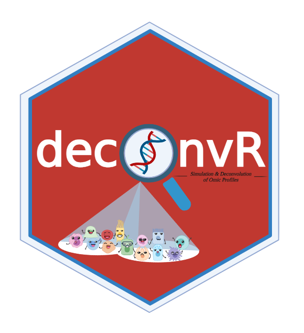

<!-- README.md is generated from README.Rmd. Please edit that file -->

# deconvR : Simulation and Deconvolution of Omic Profiles 

[](https://github.com/BIMSBbioinfo/deconvR/actions/workflows/check-bioc.yml)
[](https://github.com/BIMSBbioinfo/deconvR/actions/workflows/R-CMD-check.yaml)
[](https://github.com/BIMSBbioinfo/deconvR/actions/workflows/test-coverage.yaml)
[](https://codecov.io/gh/BIMSBbioinfo/deconvR)
[](https://bioconductor.org/checkResults/release/bioc-LATEST/deconvR)
[](https://bioconductor.org/packages/stats/bioc/deconvR)

<!-- badges: start -->
<!-- badges: end -->

The **deconvR** package designed for analyzing deconvolution of the bulk
sample(s) using an atlas of reference signature profiles and a
user-selected model (non-negative least squares regression, support
vector regression, quadratic programming, or robust linear regression).
Users can upload or expand their own reference atlases using the
`findSignatures` function, or they can choose to use the reference atlas
provided in the package. `simulateCellMix` function included to simulate
a bulk signature profile of a given size. Additionnaly, `BSmeth2Probe`
function can be used to map methylation data to probe IDs.

## Installation

The deconvR package can be installed from Bioconductor with:

``` r
if (!requireNamespace("BiocManager", quietly = TRUE))
    install.packages("BiocManager")

BiocManager::install("deconvR")
```

You can also install the development version of the **deconvR** directly
from GitHub:

``` r
remotes::install_github("BIMSBbioinfo/deconvR")
```

## How to Use deconvR

User who wish to expand their own reference atlas can use
`findSignatures` function. `atlas` is the signature matrix to be
extended and `samples` the new data to be added to the signature matrix.
`atlas` and `samples` are compliant with the function requirements.
After providing appropriate `atlas` format, users can create `samples`
using `simulateCellMix` function.
